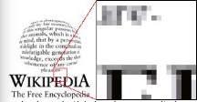
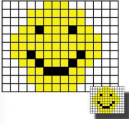
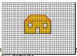

Decimo passo: la grafica
========================

.. role:: blue

.. role:: boltblue

In questo passo imparerai a scrivere programmi in Python che ti consentiranno di produrre semplici disegni  e animazioni sul video.

Per comprendere bene come funziona il video di un personal computer e come scrivere poi le istruzioni che ti consentiranno di disegnare sul video, devi prima ascoltare il racconto che segue, un po' lungo e noioso ma utile a capire come è fatto il video di un PC.

:blue:`Cominciamo con la codifica delle immagini.`

Osserva attentamente le immagini della televisione o del video del PC e vedrai che sono formate da una serie di quadratini molto piccoli, quasi puntini, uno vicino all'altro.

Ingrandendo l'immagine i quadratini si vedranno  molto bene.

| Ecco cosa succede all’immagine di un volto che sorride se la ingrandiamo tantissime volte. I quadratini da cui è formata sono evidentissimi.
| E se ingrandiamo un pezzo della scritta Wikipedia usando uno qualunque dei molti programmi di grafica?

--------

Il pixel
========

Nella TV i puntini sono circa 500 su ogni riga e ci sono circa 300 righe sullo schermo, quindi in tutto ci sono 150.000 puntini. I puntini sono di materiale fosforescente. Questi puntini si chiamano "pixel" (picture element), o “elemento di un'immagine”, e sia sul PC che sulla TV possono essere in bianco e nero o colorati. Adesso comincia ad analizzare i puntini in bianco e nero perché quelli colorati sono un poco più complicati. Inoltre, supporrai quasi sempre che un puntino sia bianco oppure nero. Nella grafica più raffinata un puntino può essere non soltanto bianco e nero ma anche grigio più o meno scuro.
Prendi ora l'immagine di una casetta e pensa di rappresentarla sul monitor del calcolatore. Sovrapponi poi al disegno una griglia di quadratini ognuno dei quali rappresenta un "pixel". Scrivi  0 se nel quadratino c'è più bianco che nero, oppure 1 se c'è più nero (o colore).
Ora prova a farlo con due griglie diverse: la prima ha i quadratini di 1 cm e la seconda di 0,5 cm.
Prova a riempire di 1 e 0 le due griglie e conta quanti puntini ci sono nel primo esempio e quanti nel secondo.

Verificherai che se i quadratini sono più piccoli il disegno verrà meglio; in linguaggio tecnico si dice che è più definito.

+-----------------------------------------------------------------------------------------------------------------------------------------------+
|**La definizione di un’immagine si chiama risoluzione ed è il numero di quadratini che ci sono in una certa area.**                            |
|Un’immagine ha una risoluzione più alta quando i puntini per area sono tanti, ha una risoluzione bassa se i puntini sono pochi.                |
|La risoluzione di uno schermo si misura moltiplicando il numero di pixel di ogni riga per il numero di righe.                                  |
|Ad esempio, la risoluzione dello schermo televisivo, che è 500 x 300, corrisponde a 300 righe ciascuna delle quali è composta da 500 pixel.    |
|La risoluzione dello schermo TV è molto bassa, sui video dei PC usati per applicazioni di grafica si arriva a risoluzioni di 4096 x 3300 pixel.|
+-----------------------------------------------------------------------------------------------------------------------------------------------+

Come hai appena visto, un'immagine viene rappresentata con dei puntini e la perfezione del disegno dipende dal numero dei puntini e quindi dai bit. Servono tantissimi bit per rappresentare bene un'immagine.

L'enorme quantità di bit necessaria per rappresentare bene un'immagine è il motivo per cui ci vuole tanto tempo per "scaricare" un'immagine da Internet. Poiché le immagini sul video sono composte da tanti puntini, uno vicino all’altro, o se preferisci da tanti bit, anche un'immagine può essere rappresentata sul calcolatore come una lunga fila di bit. Si dice che i pixel possono essere accesi (quando il quadratino è nero o colorato) o spenti (quando il quadratino è bianco) e l'immagine si può rappresentare semplicemente dicendo che un pixel e' acceso e l'altro e' spento.

Questo si può dire con un codice, ad esempio 0 = spento, 1 = acceso.

:blue:`Esaminiamo ora come funziona lo schermo in bianco e nero`

Per gli schermi a colori il discorso è un po' più complesso; per ora quindi cerca di comprendere come funziona lo schermo in bianco e nero. Inoltre supponi che il puntino possa essere soltanto bianco o nero, ma non grigio.

L'immagine della casetta si trasforma in una lunga fila di 1 e 0 (di bit). Se pensi questi bit come dei puntini fosforescenti, puoi dire che = 1 significa puntino acceso, = 0 significa puntino spento (in parole povere, luce o non luce su un certo puntino dell’immagine).

Ricorda che con 150.000 bit puoi descrivere un'immagine in bianco e nero su uno schermo televisivo, ma ne hai bisogno di 500.000 per descrivere la stessa immagine sul PC. Questo perché il video del PC ha molte più righe e molte più colonne; anzi sul PC puoi decidere tu quante righe e colonne usare. Partendo da 800 colonne x 600 righe, puoi arrivare fino ai più potenti video che hanno 1280 colonne x 1024 righe.

Un'immagine digitale e' composta da una serie di bit (0 e 1) che rappresentano il valore dei pixel corrispondenti.

L'immagine nel calcolatore sarà una lunga sequenza di 0 e 1, che saranno usati proprio come  comandi per decidere se  accendere o spegnere i pixel da una apposita "memoria" del PC; infatti il video del PC ha una memoria che si chiama “memoria video”, dove sono scritte le sequenze di 0 e 1 che comandano la luce sui pixel.

Quindi la memoria video, in cui è descritta l'immagine come una sequenza di 0 e 1, trasmette al video i comandi da eseguire per rappresentare l'immagine.

L’operazione di trasformazione di un’immagine in una sequenza di bit si chiama anche "discretizzazione": l'immagine può cambiare la sua intensità, cioè può essere semplificata, approssimata o complicata. “Immagine digitale”, “TV digitale”, “macchina fotografica digitale” ecc., con queste espressioni indichiamo tutti gli apparati le cui immagini sono rappresentate con  numeri (puntini).

+------------------------------------+---------------------------------------------------------------------------------------+
|:boltblue:`VOCABOLARIO ELETTRONICO` | :boltblue:`PIXEL` = :blue:`picture element = elemento di un’immagine.`                |
|                                    +---------------------------------------------------------------------------------------+
|                                    | :boltblue:`RISOLUZIONE` = :blue:`numero di pixel per unità di lunghezza,              |
|                                    | si misura in DPI (dot X inch, punti per pollice).`                                    |
|                                    +---------------------------------------------------------------------------------------+
|                                    | :boltblue:`IMMAGINE DIGITALE` = :blue:`immagine rappresentata con 0 e 1               |
|                                    | (puntini o pixel).`                                                                   |
|                                    +---------------------------------------------------------------------------------------+
|                                    | :boltblue:`MEMORIA VIDEO` = :blue:`memoria apposita del PC per il comando del video.` |
|                                    +---------------------------------------------------------------------------------------+
|                                    | :boltblue:`DISCRETIZZARE` = :blue:`trasformare un'immagine in bit (0 e 1), si può     |
|                                    | dire anche "numerizzare" o "digitalizzare".`                                          |
+------------------------------------+---------------------------------------------------------------------------------------+

Le librerie
===========

In conclusione, potresti produrre un disegno sul video scrivendo un programma fatto da molte istruzioni che precisino i punti dello schermo che vuoi illuminare uno alla volta. Ma occorrerebbero troppe istruzioni e molto tempo per produrre disegni anche molto semplici.

Fortunatamente altri programmatori prima di te hanno scritto delle funzioni che ti consentono di disegnare parti di un disegno con uno sforzo molto piccolo.

Queste funzioni sono state raccolte in una "libreria", che è appunto un insieme di funzioni che il programma principale potrà richiamare quando ne ha bisogno.

