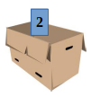
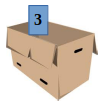
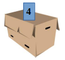
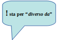

Ottavo passo: i Cicli
=====================

.. role:: red

.. role:: boltred

.. role:: blue

.. role:: boltblue

Impariamo insieme a:

 • ad usare i cicli "loop"
 • a creare cicli annidati
 • quando è opportuno utilizzare l'istruzione while
 • oppure usare l'istruzione for
 • a conoscere e utilizzare meglio le stringhe

Come già sai è possibile assegnare più valori ad una stessa variabile, con la variabile che assume sempre l'ultimo valore assegnato.

Ad esempio:

::

	Num = 3 	
	print (Num) 	
	Num = 9
	print (Num)

Il risultato di questo programma è  3  9, perché la prima volta che Num è stampato il suo valore è 3, la seconda 9.

Nota bene: la keyword (“parola chiave”) end = " " evita il ritorno a capo dopo una stampa; in questo modo entrambi i valori appaiono sulla stessa riga.

Prova a eseguire il seguente programma e analizza cosa succede.

.. activecode:: esempio_ciclo1
   :nocanvas:
   :language: python

   a = 1 
   while a < 4 :
   	print (a)
   	a = a + 1

Prova a leggere il programma con l'istruzione while come fosse scritto in un linguaggio naturale (while significa: finchè, fino a quando, fintantoche`). Otterrai:
"Finché (while) a è minore di 4 stampa il valore di a e poi aumentalo di 1. Quando arrivi a 4 esci perché  a deve essere minore di 4”.

Se non ci riesci prosegui a leggere: troverai i due programmi analizzati in dettaglio più avanti.

--------

Come hai capito questo comando viene usato per eseguire le azioni ripetitive e i computer sono bravissimi a ripetere le azioni tante volte. Per risolvere questo tipo di problema si usano i “cicli” o “loop”.

:boltblue:`Ci sono due tipi di "cicli"` e tra i due c'è una differenza molto importante.
Il primo, chiamato :boltblue:`while`, viene usato quando non si sa prima quante volte deve ripetere l'azione.

Il secondo, chiamato :boltblue:`for`, è usato quando si sa in anticipo quante volte dovrà ripetere l'azione.

Tralasciamo per un attimo il ciclo for, che studieremo nel prossimo step, per imparare bene ad utilizzare:

::

	while <relazione> :

Riprendiamo ora il semplice programmino di prima:	

::

	a =1 
	while a < 4 :
		print (a)
		a = a + 1	

Avete visto che il programma visualizza: 

| 1     
| 2
| 3

**Nota bene:**

L’istruzione  :boltred:`while`:  significa: **"fai tutto quello che segue fintantoché la relazione scritta fra la parola while e i due punti è  soddisfatta".**

**I due punti sono obbligatori.**

:boltblue:`In modo più formale ecco il flusso di esecuzione di un'istruzione while:`

 1. :blue:`Valuta la condizione controllando se essa è vera o falsa.`
 2. :blue:`Se la condizione è falsa esci dal ciclo while e continua l'esecuzione dalla  prima istruzione che lo segue.`
 3. :blue:`Se la condizione è vera esegui tutte le istruzioni nel corpo del while e torna al passo 1.`

Nel nostro caso il programma esegue le istruzioni:

::

	print (a)
	a = a + 1

tre volte, cioè finchè a è minore di 4.

--------

Ecco in dettaglio quello che succede in quelle tre volte:

:boltblue:`LA PRIMA VOLTA`

::

	a vale 1
	La relazione a < 4 è soddisfatta
	Il programma esegue prima print a
	e visualizza 1
	poi esegue a = a + 1
	e pone il valore 2 nella scatola a

:boltblue:`LA SECONDA VOLTA`

::

	a vale 2
	a < 4 è ancora soddisfatta
	Il programma esegue print a e visualizza il valore di a,
	cioè 2 e
	pone il valore 2 + 1 = 3 nella scatola a

:boltblue:`LA TERZA VOLTA`

::

	a vale 3
	a < 4 è soddisfatta
	Il programma visualizza il valore di a, cioè 3,
	ed esegue a = a + 1 ponendo 4 nella scatola a.

:boltblue:`LA QUARTA VOLTA`

::

	a vale 4
	Il programma esce dal ciclo.

**Nota bene: Tutte le istruzioni che seguono la**

::

	while <relazione>

**devono essere indentate se fanno parte delle cose da fare quando <relazione> è soddisfatta.**

Se la condizione è falsa al primo controllo, le istruzioni del corpo non saranno mai eseguite.

Il corpo del ciclo dovrebbe cambiare il valore di una o più variabili così che la condizione possa prima o poi diventare falsa e far così terminare il ciclo. In caso contrario il ciclo si ripeterebbe all'infinito e il calcolatore non si fermerebbe mai.

:boltblue:`ESERCITIAMOCI UN PO’`

:boltblue:`Prova ad eseguire  questi due programmi:`

**Programma 1**

::

	a = 1
	while a < 5 :
		a = a + 1

**Programma 2**

::

	a = 1
	while a < 10 :
		a = a + 1

.. activecode:: esercizio_ciclo
   :nocanvas:
   :language: python

*Cosa fanno questi due programmi?*

*Perché il secondo dura più del primo?*

*A cosa possono servire questi programmi?*

*Qualche volta, nel corso di un programma complesso, può essere opportuno fermarsi un po’ di tempo per consentire all’utilizzatore del programma di riflettere prima di proseguire.*

*I due programmi precedenti servono proprio a questo, ossia a perdere tempo.*

| *Quanto tempo?*
| *Dipende dalla velocità del calcolatore. Infatti, un calcolatore molto veloce può eseguire una delle due istruzioni:*

::

	while a < 100:
		a = a + 1

*in un decimo di milionesimo di secondo.*

*Prova a rispondere a questa domanda: fa perdere più tempo il programma 1 oppure il programma 2?*

:blue:`ALTRI ESERCIZI`

Visualizza tutti i numeri compresi fra 3 e 9.

::

	i = 3
	while i <= 9 :
		print (i)
		i = i + 1

--------

Visualizza tutti i numeri compresi fra 0 e 20.

::

	i = 0
	while i <= 20 :
		print (i)
		i = i + 1

--------

Visualizza in ordine decrescente i numeri da 20 a 10.

::

	i = 20
	while i >= 10 :
		print (i)
		i = i - 1

--------

Scrivi il programma "Conto alla rovescia" che: finché (while) n è più grande di 0, stampa il valore di n e poi lo diminuisce di 1. Quando arriva a 0 stampa la stringa "Pronti ...VIA!".

::

	n = 10
	while n > 0 :
		print (n)
		n = n - 1
	print ("Pronti ...VIA!")

--------

*Eseguendo il programma precedente, scopri che la visualizzazione dei numeri è troppo veloce. Come fai per rallentarla? (la soluzione l’hai già trovata in questo STEP!)*

| Scrivi un programma che attende finchè non viene inserita la password corretta. 
| (La password la decidi tu, ad es. “chicchiricchi”).  

::

	password = "python"
	while password != "chicchiricchi":
		password = input ("Password:")
	print ("Entra pure")

--------

Visualizza tutti i numeri dispari compresi fra 1 e 100.

::

	i = 1
	while i < 100 :
		print (i)
		i = i + 2

.. activecode:: esercizio_ciclo1
   :nocanvas:
   :language: python

   # Esercitati qua

``***`` Prova a trovare i divisori di un numero usando il ciclo while.(Se non riesci, la soluzione è illustrata nelle pagine seguenti)

::

	i = 1
	n = int(input ("qual è il numero di cui vuoi trovare i divisori? "))
	print (n, " è divisibile per ") 
	while i < n :
		if n % i == 0 :
			print (i)
		i = i + 1

``***`` Scrivi un programma che chieda il risultato dell'operazione 15 x 17 tante volte sino a quando non viene indicata la soluzione corretta. (Se non riesci, la soluzione è illustrata nelle pagine seguenti)

::

	corretto = "no"
	while corretto == "no":
		risposta = float(input ("quanto vale 15 x 17? "))
		if risposta == 15 * 17:
	        	corretto = "si"
        		print ("Bravo!")
    		else:
			corretto = "no"

:boltred:`SECONDA PARTE: I CICLI ANNIDATI`

| Precedentemente abbiamo risolto il programma che visualizza il conteggio alla rovescia che però è troppo veloce.
| Troppo.
| Avete trovato la soluzione per rallentarlo?
| Se si, bene!  Leggete comunque come abbiamo illustrato la soluzione qui di seguito.

Per rallentarlo introduciamo il programma che abbiamo già scritto e che serviva a perdere tempo:

::

	a = 1
	while a < 100 :
		a = a+1

e nella relazione da verificare decidiamo quanto aspettare. La soluzione che conta lentamente non è altro che la fusione dei due programmi.

::

	n = 10
	while n > 0 :
		print (n)
		a = 1
		while a < 1000000 :
			a = a + 1
		n = n - 1
	print ("Pronti ...VIA!")

.. activecode:: esercizio_tempo
   :nocanvas:
   :language: python

   n = 10
   while n > 0 :
   	print (n)
   	a = 1
	while a < 1000 :
		a = a + 1
	n = n - 1
   print ("Pronti ...VIA!")

Nota bene: Quest'ultimo programma contiene due cicli while, di cui il secondo, quello introdotto per "perdere tempo", è :boltred:`ANNIDATO` entro il primo.

| Notate bene anche come è stato scritto il programma:
| l'istruzione while a < 1000000 è indentata rispetto a while n > 0
| mentre l'istruzione a = a + 1 è indentata rispetto a while
| a < 1000000

| Quante volte viene eseguita l'istruzione a = 1?
| Quante volte viene eseguita l'istruzione a = a + 1?

| Riprendiamo adesso due esercizi fatti in precedenza (quelli con ``***`` ).
| La soluzione del primo e' un esempio di annidamento dove l'istruzione annidata è una if. La soluzione è la seguente:

::

	i = 1
	n = int(input ("qual è il numero di cui vuoi trovare i divisori? "))
	print (n, " è divisibile per ") 
	while i < n :
		if n % i == 0 :
			print (i)
		i = i + 1

Nel secondo la if annidata è più complessa:

::

	corretto = "no"
	while corretto == "no":
		risposta = float(input ("quanto vale 15 x 17? "))
		if risposta == 15*17:
	        	corretto = "si"
        		print ("Bravo!")
    		else:
			corretto = "no"

Fai attenzione  all'indentazione con cui sono scritte le istruzioni perché è fondamentale per avere un'esecuzione corretta del programma!

Vediamo qualche altro esempio:

--------

Scrivi un programma per stampare il quadrato e il cubo dei numeri da 1 a 10.

::

	i = 1
	while i <= 10 :
		e = 2
		while e <= 3 :
			print (i ** e)
			e = e + 1
		i = i + 1

--------

Scrivi un programma che chiede una sequenza di numeri da aggiungere ad una somma. Per terminare inserisci 0.

::

	a = 1
	somma = 0
	print ('Inserisci i numeri da aggiungere alla somma ')
	print ('Quando hai finito inserisci 0')
	while a != 0 :
	        print ('La somma è:', somma)
	        a = float(input('Numero? '))
	        somma = somma + a
	print ('Totale =',somma)

--------

Scrivi un programma per stampare la Tavola Pitagorica.

| *Attenzione: la stampa dei numeri non risulterà bene in colonna.*
| *Prova a trovare il modo per stampare bene le colonne.*

::

	print (" TAVOLA PITAGORICA")
	riga = 1
	while riga <= 10 :
		colonna = 1
    		while colonna <= 10 :
        		print ('\t', riga * colonna) 
       			colonna = colonna + 1
    		riga = riga + 1

--------

Indovina un numero! Scrivi un programma per indovinare un  numero

::

	numero = 27
	indovina = 0
	while indovina!= numero : 
		indovina = float(input ("Indovina un numero: "))
		if indovina > numero:
		        print ("Troppo grande")
		if indovina < numero :
           		print ("Troppo piccolo")
	print ("BRAVO!!")

--------

.. activecode:: esercizio_cicliAnn
   :nocanvas:
   :language: python

--------

Se non sei riuscito a stampare in maniera ordinata le colonne? 

Nessun problema. 

Adesso ti spiego un “trucco” per formattare le stampe.

Il carattere di backslash '\' (barra inlinata rovesciata) indica l'inizio di quella che viene chiamata una **sequenza di escape**.
Le sequenze di escape sono usate per rappresentare caratteri *speciali* e invisibili  come la tabulazione ('\t') e il ritorno a capo ('\n') e possono comparire in qualsiasi punto di una stringa.
Prova ad esempio a stampare una stringa unica che produca questo risultato:

::

	vengo
		subito
			a casa

::

	print ("vengo \n \t subito \n \t \t a casa")

:boltred:`...ancora sulle STRINGHE`

Sinora abbiamo visto che una stringa è una serie di caratteri, cifre, lettere o altri simboli che si trovano sulla tastiera, cioè un messaggio qualunque. Inoltre, sappiamo che una stringa per essere considerata tale deve essere racchiusa tra virgolette (semplici o doppie) e che si possono fare alcune operazioni con le stringhe.
Possiamo scrivere:
"ciao" * 3 **oppure** "ciao" + "ciao" + "ciao" **oppure** "ciao" * 2 + "ciao"

invece

"ciao"/4 **oppure** "ciao" + 5 **oppure** "18" + 8

| sono sbagliate e generano un syntax error.
| Vi ricordate come si chiamano le operazioni sulle stringhe?

Che cosa hanno di diverso le stringhe dagli altri tipi di dati (interi, floating point)?

Le stringhe sono qualitativamente diverse dagli altri tipi di dati perchè sono composte di unità più piccole: i caratteri. Per questo le stringhe sono dati "composti" in alternativa ai dati "semplici" che sono gli interi e i floating point.

Questo ci consente di trattare una stringa come fosse una singola entità oppure di agire sulle sue singole parti (i caratteri) a seconda di ciò che stiamo facendo. Come si fa ad agire sui singoli caratteri?

Secondo te quale sarà il risultato di questo programma?

::

	squadra = "Juventus"
	messaggio = squadra[0] + squadra [1] + squadra [2] + squadra [3] + squadra [4] + squadra [5] + squadra [6] + squadra [7]
	print (squadra)
	print (messaggio)

| Come si individuano i singoli caratteri.
| Nella variabile squadra abbiamo messo la stringa tutta intera mentre nella variabile messaggio l'abbiamo inserita un carattere per volta. squadra[i] e` una stringa fatta di un solo carattere e non e` altro che il carattere di Juventus che occupa la posizione i + 1.

L'espressione tra parentesi quadrate seleziona i caratteri della stringa.  Quindi squadra[0] seleziona il primo carattere,  [1] il secondo e cosi via.

Ricordati che i calcolatori iniziano sempre a contare da 0.

L'espressione tra parentesi quadrate è chiamata indice. 

Un indice individua un particolare elemento di una stringa e può essere una qualsiasi espressione intera.

Un’espressione aritmetica negativa come –i fra parentesi quadre [-i] indica il carattere posto nella posizione (i + 1) a partire dal fondo della stringa.

Così, ad esempio:
squadra[-0]  è uguale al carattere "s"
squadra[-2] è uguale al carattere "t"

Cosa otterrai eseguendo il seguente programma?

.. activecode:: esempio_stringa
   :nocanvas:
   :language: python

   squadra = "Juventus"
   messaggio = "VIVA" + " " + squadra[0] + squadra[1] + squadra[2] + squadra[3]
   print (squadra)
   print (messaggio)

