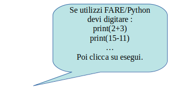
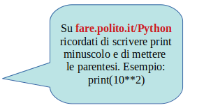

=================================================
**Primo passo:   usare Python come calcolatrice**
=================================================

.. role:: red

.. role:: boltblue

Supponiamo che sul video compaia questo simbolo:  >>>. 
E’ un messaggio di Python che vuol dire: :red:`“Cosa vuoi sapere?”`
Se vuoi sapere quanto fa 2+3, devi scrivere 2+3 al fianco di 
>>>.
Esempio:
>>> 2+3

    

Subito dopo la pressione del tasto del calcolatore che usi 
per andare solitamente “a capo”, il calcolatore ti risponderà come vedi:

.. activecode:: somma
   :coach:
   :caption: 

   print(2+3)
  

Vediamo altri esempi:     

>>> 15-11
4

>>> 2*3
6

>>> 15/5
3                                     
                                     

Quindi il simbolo :red:`+` è il comando per eseguire una somma;
il simbolo :red:`–` è l’ordine di eseguire una sottrazione; 
il simbolo :red:`*` indica una moltiplicazione;
i simboli  :red:`/` e :red:`//` indicano la divisione.
Ora impariamo anche l’uso del simbolo :red:`**` che viene 
chiamato :red:`"elevato a”`
e che ha il significato mostrato 
nei seguenti esempi:

:::::::::::::::::::

**PRIMO ESEMPIO**

.. activecode:: primo esmpio
   :coach:
   :caption: ossia 2*2*2,tre volte
  
   print(2**3)

:::::::::::::::::::

**SECONDO ESEMPIO**

>>> 2**4
16

   
ossia 2*2*2*2,quattro volte

   

Adesso prova tu ad esercitarti usando Python. Prova a scrivere:

>>> 10**2

>>> 10**3

>>> 3**2

>>> 3**3

Come anticipato, possiamo usare due simboli diversi per la divisione. 
Ai due simboli diversi corrispondono operazioni un po’ diverse, come mostrato 
nei seguenti esempi:

>>> 5/2   (e poi dai invio) otterrai:
2.5

Verifica ancora:

>>> 15/4 (e poi dai invio) otterrai:
3.75

Se invece scriviamo: 

.. activecode:: esempio3
   :coach:
   :caption: divisione con //
   
   print(5//2)
   
   print(5.0//2.0)

otteniamo la parte intera della divisione.

In sintesi, Python  possiede due divisioni che si 
ottengono con i due simboli / e //. La prima divisione 
genera numeri con virgola, la seconda divisione 
produce la parte intera del risultato.

Se in una divisione ti interessa solo sapere il resto usa il simbolo %: 

.. activecode:: esempio
   :coach:
   :caption: divisione con %
   
   print(15%12)

**Fai attenzione**. Gli americani, quando usano i numeri decimali, usano il punto 
(.) e non la virgola. Anche Python segue questo sistema.

Si possono scrivere tante operazioni una dopo l’altra che 
verranno eseguite nell’ordine con cui sono scritte, con qualche 
differenza. Infatti prima bisogna eseguire  gli :red:`**` e poi i :red:`*` o :red:`/` e 
in ultimo i :red:`+` o i :red:`-`. **Di seguito alcuni esempi**.

.. activecode:: operazioni1
   :coach:
   :caption: serie di operazioni
   
   print(2*3+4)

.. activecode:: operaioni2
   :coach:
   :caption: serie di operazioni
   
   print(6/2-1)

>>> 10+3*2
16(Infatti il calcolatore prima calcola 3*2 =6 e poi calcola 10+6)

>>> 10+3*2**3
34(Infatti il calcolatore prima calcola 2**3 =8, poi calcola 3*8 =24 e infine
calcola 10+24 =34).

Per chiedere al calcolatore di eseguire le operazioni in un ordine ben preciso
posso usare le parentesi tonde ( ).
Supponiamo, ad esempio, di voler calcolare il numero delle zampe degli animali
che vivono nella casa di Mario, sapendo che
ha 2 cani e 3gatti. Devo scrivere:

.. activecode:: parentesi
   :coach:
   :caption: operazioni con parentesi tonde
   
   print(2+3)*4

Una coppia di parentesi può stare dentro una frase 
delimitata da altre parentesi, come quando devo fare un 
calcolo più complicato. Esempio:

.. activecode:: parentesi2                          
   :coach:                                            
   :caption: operazioni con più parentesi         
       
   print(20*(4+1))/(3+1)                             

   print((20*(4+1))/(3+1))                                  

*Riassumendo: Python segue le stesse regole
della matematica per quanto riguarda l’ordine
di esecuzione delle operazioni:
Prima le parentesi (partendo da quelle più
interne), poi l’elevamento a potenza, poi
moltiplicazione e divisione e infine somma e addizione.*

*Quando due operatori hanno la stessa priorità si 
procede da sinistra verso destra*

:boltblue:`Esercitiamoci un po’.`
:::::::::::::::::::::::::::::::::                             

**Esegui il calcolo dell’ espressione:** 
 

  4+4.5-(6*4/2)  
                                         

**Scrivi l’espressione per calcolare “quanti mesi hai”.** 

**Inventa un’espressione che dia come risultato 48**
**ed una che dia come risultato 11.**

**a) Per andare da casa di Sandrone a casa di Giulia ci sono 3 km** 

**b) per andare da casa di Giulia a casa di Clotilde ci sono 4 km.**
**Scrivi un’espressione che calcoli quanti km deve fare Sandrone per**
**andare a trovare Giulia e Clotilde  e tornare a casa ripassando da casa**
**di Giulia.**
**Ora calcola quanti km ci vogliono per andare a trovare i tuoi 4 migliori**
**amici e poi tornare a casa.**

**Misura il banco di scuola. Trova l’area del ripiano del banco.**

**Calcola l’area della tua aula.**

