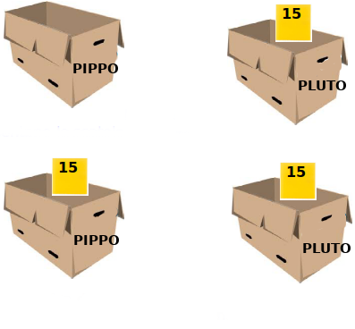
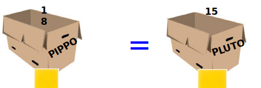

=================================
**Quinto passo: primi programmi**
=================================

.. role:: boltred

.. role:: blue

.. role:: red

.. role:: boltblue

.. role:: green

**Iniziamo a vedere come fare a passare da una scatola all’altra.**

:boltblue:`ISTRUZIONE DI COPIA`
===============================

Cosa succede quando diamo al computer un'istruzione come: 
PIPPO = PLUTO
Il computer fa le seguenti operazioni: 

1. mette a disposizione la scatola di nome PIPPO

2. apre la scatola di nome PLUTO 

3. legge il contenuto (vi ricordate il foglietto nella scatola?) di PLUTO lo ricopia 

4. lo ricopia su un altro foglietto che  mette nella scatola PIPPO.

Al termine di queste operazioni le due scatole PIPPO e PLUTO contengono lo stesso numero 15. 
:blue:`Ecco come si presentano le scatole prima e dopo dell’esecuzione dell’istruzione:`

:blue:`Osserva`: il contenuto di Pluto (la scatola che si trova a destra del segno =) viene trasferito in Pippo e non viceversa e che Pluto non perde il suo contenuto. Perché?
:blue:`PERCHE’ E’ UNA COPIATURA` e non un trasferimento.

E se invece nella scatola Pippo ci fosse stato un fogliettino 
con scritto 5?
Il risultato dopo l’istruzione sarebbe stato lo stesso. 
Cosa succede invece se scriviamo: 

PLUTO = PIPPO,
*quando* 
PIPPO = 5 e PLUTO = 15? 

Le due scatole conterranno il numero 5. 

Vediamo come scrivere i programmi corrispondenti a queste due istruzioni: 

**Programma1 PIPPO=PLUTO**
::

	PIPPO=5
	PLUTO=15
	print ("PIPPO = ", PIPPO)
	print ("PLUTO = ", PLUTO)
	PIPPO = PLUTO
	print ("Dopo l'esecuzione dell'istruzione PIPPO = ", PIPPO) 
	print ("Dopo l'esecuzione dell'istruzione PLUTO = ", PLUTO)
	
	# Risultato Atteso:
	# PIPPO = 5
	# PLUTO = 15
	# Dopo l’esecuzione dell’istruzione PIPPO = 15 
	# Dopo l’esecuzione dell’istruzione PLUTO = 15 
                

**Programma 2 PLUTO = PIPPO**

.. activecode:: Copiatura
   :coach:
   :caption: Come copiare
   
   PIPPO=5
   PLUTO=15
   print ("PIPPO = ", PIPPO)
   print ("PLUTO = ", PLUTO)
   print ("PLUTO = ", PIPPO) 
   print ("PIPPO = ", PIPPO)

:boltblue:`INCREMENTO` 
======================

Prova a immaginare cosa fa il computer per eseguire la seguente istruzione:

**PIPPO = PLUTO + 3**

Il computer farà così: 

    - Metterà a disposizione una scatola di nome PIPPO
    - Cercherà PLUTO e ne leggerà il contenuto.
    - Aggiungerà 3 al contenuto di PLUTO e metterà in PIPPO il risultato dell’operazione a destra dell’uguale. 
      
A questo punto, che cosa conterrà PIPPO e che cosa conterrà PLUTO? 
**PIPPO conterrà il numero 18 e PLUTO conterrà sempre il numero 15.** 
In pratica il computer inizia a lavorare sull’operazione a destra dell’uguale e il risultato viene messo nella scatola a sinistra.
Osserva ancora che il nome della scatola a destra dell’uguale indica il suo contenuto, mentre il nome della scatola a sinistra precisa la scatola
che conterrà il risultato.

 
:boltblue:`LO SCAMBIO`
======================
 
Un po’ più complicata è l’operazione di scambio del contenuto di due scatole. 
Ad esempio se MINNI = 10 e MICKEY = 12 come posso scambiare il contenuto di MINNI e MICKEY, cioè inserire 12 in MINNI e 10 in MICKEY?
E’come scambiare il contenuto di due bicchieri uno pieno di Coca Cola e l’altro pieno di aranciata. In quel caso occorre un terzo bicchiere. 
Nel nostro caso serve una **terza scatola!**
Esatto. Una scatola che possiamo chiamare, ad esempio, PARK, 
nella quale riponiamo il contenuto di una delle due scatole. Cosa fa il computer?  
    
    1. Apre le due scatole già disponibili di nome MINNI e di nome MICKEY. 
    2. Mette a disposizione una scatola di nome PARK e ci inserisce il contenuto di MINNI. 
    3. Legge il contenuto di MICKEY e lo mette in MINNIE. 
    4. Legge il contenuto di PARK (che era quello di MINNIE) e lo mette in MICKEY. 

+-------------------------------+-----------------------------+
| :blue:`MINNIE= 10; MICKEY= 12`|                             |
+-------------------------------+-----------------------------+
| :blue:`PARK= MINNIE`          | :boltblue:`PARK=.......`    |
|                               |                             |
|                               | :boltblue:`MINNIE =......`  |
+-------------------------------+-----------------------------+
| :blue:`MINNIE= MICKEY`        | :boltblue:`MINNIE=.......`  |
|                               |                             |
|                               | :boltblue:`MICKEY =......`  |
+-------------------------------+-----------------------------+
| :blue:`MICKEY= PARK`          | :boltblue:`PARK=.......`    |
|                               |                             |
|                               | :boltblue:`MINNIE =......`  |
+-------------------------------+-----------------------------+

:blue:`Prima di proseguire...esercitiamoci un po’`

|
| **Esercizio n. 1** 
|
|	Se CLICK1 = 24 e SLAM1 = 32 come faccio per copiare il contenuto di CLICK1 in SLAM1? E quando l’ho copiato come faccio per rimettere
|       nelle due scatole il contenuto originale? Prova a illustrare i vari passaggi attraverso i quali il calcolatore copia il contenuto di una
|       scatola a un'altra. 
|

|
| **Esercizio n. 2** 
|
|	Scrivi un programma per scambiare il contenuto delle due scatole seguenti:
|       PLUTO = “America” 
|       PIPPO = “Asia”
|

|
| **Esercizio n. 3** 
|
|	La scatola STAR contiene il numero 8. 
|       Come posso ordinare al computer di svuotarla e di mettere 15 al posto di 8?
|

|
| **Esercizio n. 4**
|
|	La scatola BLAM contiene il numero 2. 
|       Scrivi il programma che calcola il cubo del contenuto e lo mette nella scatola BLAM3. 
|

:boltblue:`INPUT` 
=================

Finora abbiamo visto come inserire un numero o una stringa in una scatola, cioè un dato in una variabile utilizzando le istruzioni di assegnazione
del tipo:
SCATOLA1 = 37.5 oppure SCATOLA1 = "Viva la Juve" 
Oltre a questo, esiste un altro modo, molto importante, per introdurre un numero o una stringa in una scatola, rappresentato dall’istruzione
input. 

:boltblue:`INPUT`, che significa letteralmente “ingresso”, si usa nel modo seguente: 

:blue:`scatola` = :green:`input`:red:`(prompt)`

Dove:

:blue:`Scatola` è il nome della scatola nella quale inserirò un nuovo dato;

:green:`Input` è il comando che diamo al computer e che serve a inserire un dato qualunque  nella scatola. Quel dato è indicato dall’utilizzatore del programma attraverso la tastiera;

:red:`Prompt` è un messaggio che diamo all'utilizzatore perché sappia quale dato deve inserire da tastiera 

Ad esempio con:

**PLUTO = input ("Quanti anni hai?")** 
Chiediamo all'utilizzatore di indicare i propri anni, il computer leggerà il numero e lo inserirà nella
scatola di nome PIPPO. Quando il computer legge la parola input, si ferma e attende che l'operatore inserisca un numero dalla tastiera. 
Per far capire al computer quando il numero e’ finito, l’operatore preme il tasto Invio (o Enter). A questo punto il programma riprende e input
interpreta ciò che l'operatore ha inserito come una stringa di caratteri e lo mette nella scatola indicata. 
Il programma prosegue poi con le istruzioni successive. 
La funzione INPUT è molto utile nella costruzione dei programmi, perché ci permette di trasmettere dei dati al calcolatore durante L’esecuzione
del programma. 

Finora abbiamo sempre inserito tutti i dati prima dell'esecuzione di un programma e poi abbiamo eseguito il programma stesso; con input, invece,
i dati possono essere inseriti durante l'esecuzione. Vediamo in dettaglio cosa succede nel programma seguente quando usiamo la “funzione” input: 

**Anni = int (input ("Quanti anni hai? "))** 

**print ("Tu hai ", Anni, " anni")**

+-----------------------------------------+----------------------------------------+
| Anni = int (input ("Quanti anni hai? ") | 1) Il computer mette a disposizione la |
|                                         | scatola chiamata "Anni", se questan se |
|                                         | questa scatola è stata gia utilizzata; |
|                                         | oppure una scatola nuova alla quale da |
|                                         | il nome "Anni"                         |
|                                         |                                        |
|                                         | 2) si ferma nell'attesa che venga      |
|                                         | inserito un dato dalla tastiera        |
|                                         |                                        |
|                                         | 3) inserisce i dato nella scatola      | 
|                                         | indicata                               |
+-----------------------------------------+----------------------------------------+                                       
| print ("Tu hai ", Anni, " anni")        | Stampa prima la stringa “Tu hai  ”     |                                  
|                                         | poi il contenuto della scatola Anni    | 
|                                         | e infine la stringa “anni"             |
+-----------------------------------------+----------------------------------------+                                         
                                       
Utilizzando Python, prova ad eseguire il programma. 

Hai notato che prima del comando “input” abbiamo aggiunto “int”?
E’ necessario dire all’interprete quando vogliamo inserire un numero e specificare bene il tipo di numero perché altrimenti l’interprete pensa che
sia un qualunque carattere di una stringa.
Quando vogliamo :boltred:`inserire un numero intero` scriveremo: 

::

	int (input()) 

Quando vogliamo :boltblue:`inserire un numero con la virgola` scriveremo: 

::

	float (input())

Quindi per lavorare con le variabili numeriche (cioè le variabili di tipo numero) davanti al comando input si deve sempre aggiungere int o float. 

Prova a descrivere la sequenza di operazioni fatte dal calcolatore per eseguire il programma seguente :
Programma 3  “Stampa il triplo di un numero”
numero = int (input ("Introduci un numero "))
numero = numero * 3
print ("Il triplo del numero introdotto è : ", numero)
Prova ora ad inserire dei caratteri che non rappresentino un numero e osserva quale sarà il nuovo risultato. Sfortunatamente se i caratteri inseriti dall'operatore non rappresentano un numero, il programma stampa un messaggio d'errore e si blocca perché int(input()) e float(input()) funzionano soltanto con i numeri. 

**Come facciamo a far in modo che l’interprete accetti qualunque carattere immesso dall'utilizzatore?**
**Usiamo semplicemente il comando “input” senza specificare nulla.** 

**Il programma seguente:** 

::	

      	s = input ("Come ti chiami? ")
        print ("Ciao PAOLA", s)                       
	 
	#soluzione
 	#Ciao Paola
	#Ciao Alda
	#Ciao Marco 

Esercitati con gli esempi seguenti:

::

	print ("Alt! ")
	s = input ("Chi va la'? ")
	print ("Passa pure ", s)
	num = int (input ("Scrivi un numero "))
	print ("num = ", num)
	print ("num * 2 = ", num * 2)

        
**Esercitiamoci un po’** 

Ci sono più soluzioni possibili per ognuno degli esercizi proposti; sta a te trovarle e, soprattutto, provarle. 

1. Scrivi un programma che chiede un numero e ne calcola il quadrato e il cubo e li visualizza sullo schermo. 
    
2. Scrivi un programma che aggiunge 7 a qualunque numero inserito e visualizza il risultato sullo schermo. 
    
3. Scrivi un programma che chiede due numeri, li somma e visualizza il risultato. 
   
4. Scrivi il programma per calcolare l’area di qualunque rettangolo chiedendo all’utilizzatore la base e l’altezza. 
   
5. Scrivi il programma che chieda tre numeri e ne visualizzi sia la somma sia il prodotto. 
   
6. Scrivi il programma che calcola la metà e il doppio di qualunque numero inserito dall’utente, poi visualizza i risultati. 
    
7. Scrivi il programma che chiede la misura del lato di un quadrato e ne calcola l’area, poi visualizza il risultato. 
   
8. Scrivi il programma che calcola il perimetro del cortile della scuola che è un rettangolo i cui lati misurano rispettivamente 45 m e 65 m
   visualizza il risultato. Quindi calcola il perimetro di ogni rettangolo per il quale l’operatore inserisca la misura della base e
   dell’altezza. 
   
9. Scrivi un programma che chiede tre numeri, ne calcola la somma, la somma dei quadrati e il quadrato della somma. Infine, visualizza i
   risultati. 

.. activecode:: Esercizi
   :coach:
   :caption: Esercizi

**ESERCIZI CON VALUTAZIONE**

Concediamoci un momento di pausa per giocare un po’.
Prima di proseguire il nostro percorso di studio, facciamo 
un breve gioco. Giochiamo a:

:boltred:`CACCIA ALL’ERRORE!`

Regole del gioco: 
In ogni programma è inserito un errore. 
Leggi attentamente ciascun programma, prova a digitarlo utilizzando Python, scopri e correggi l’errore. 
Per ogni esercizio assegnati un punto se riesci a trovare l’errore e un altro punto se riesci a correggerlo.

------------------------------

::

         #Es. 1: 
	 stampa il nome del tuo cantante preferito.
         cantante = input ("Scrivi il nome del cantante preferito: ")
         print ("Il mio cantante preferito e' ", cantant)

------------------------------

::

       # Es. 2  	
	Input di numeri e stringhe

	Primonumero= int(input (“Scrivi il primo numero:  “))
	Secondonumero= int(input (“Scrivi il secondo numero: “))
	Nome = input (“Scrivi il tuo nome:  “)
	Cognome = input (“Scrivi il tuo cognome:  “)
	Print nome , cognome, “primonumero”, “per”, secondonumero, “uguale”, 
	primonumero*secondonumeeo
	

------------------------------

::

        #Es. 3: domanda di filosofia

	printt (" Sai in quale anno e' nato Socrate")
	sino = input ("si o no")
	print ("Ma certo, nell'anno 469 prima di Cristo")
	

------------------------------

::

        #Es. 4: divisione con resto

	primo = float (input ("Inserisci il primo numero"))
	secondo = float (input ("Inserisci il secondo numero"))
	print (primo, "diviso", secondo,"si ottiene", primo/secondo)
	print "il resto della divisione e' ", primo % secondo
	

