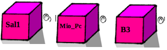
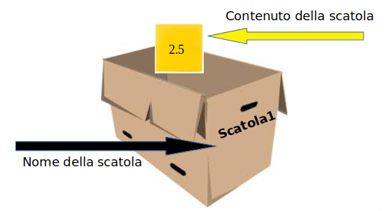

===========================
Secondo passo: le Scatole
===========================

.. role:: red

.. role:: boltred

Istruire un calcolatore significa essenzialmente creare e usare degli oggetti.
Tra questi oggetti quelli di uso più comune sono quelli che chiameremo :red:`scatole`.

Le scatole vengono usate per contenere numeri, caratteri, parole o frasi.

Le nostre scatole sono del tutto simili a quelle che vediamo nella figura. 
Ogni scatola  che noi creiamo deve avere un nome. 
Il nome che assegniamo alla scatola  è l'equivalente dell'etichetta sulla scatola.

Ovviamente dovremo scegliere dei nomi significativi per le nostre scatole per ricordarci a cosa servono.

Ad esempio:

- SCATOLA1
- SCAT1
- SAL1
- SALAME
- PIPPO
- PIPPO4C
- SCARPONIASI.

Sono validi anche nomi molto corti come:

- A
- B
- C
- A1
- B3

o lunghi come:

|
|	:red:`ILNOMEPIULUNGOCHEMIVIENEINMENTEPERILMIOCANE`
|

*I nomi delle scatole possono essere lunghi quanto si desidera e possono contenere lettere, cifre e il sottolineato _, ma non devono iniziare con una cifra. È legale usare sia lettere maiuscole sia minuscole.*

*Ricordatevi comunque che per Python i caratteri minuscoli sono diversi dai caratteri maiuscoli.*

Quindi le scatole che si chiamano:

- :boltred:`Luisa`
- :boltred:`luisa`
- :boltred:`LUISA`

**sono per il calcolatore tre scatole diverse.**

.. image:: images/scatole2.png
   :align: center
   :width: 275pt

Il carattere di sottolineatura (_) può far parte di un nome ed è spesso usato in nomi di scatole composti da più parole. Ad esempio:

+-------------------------+-------------------------+
| **il_mio_nome**         | **il_prezzo_del_pane**  |
+-------------------------+-------------------------+

In alternativa i nomi possono essere composti  usando l'iniziale maiuscola per ciascuna delle parole componenti il nome della variabile, con il resto dei caratteri lasciati in minuscolo come in :

+-------------------------+-------------------------+
| **IlMioNome**           | **IlPrezzodelPane**     |
+-------------------------+-------------------------+

Non e' possibile invece “battezzare” la  nostra scatola  con nomi come 1A, 3P, 4SAL **perché il suo nome non può iniziare con un numero**. Assegnando un nome di questo tipo ad una scatola otterremo un messaggio di errore. Il  calcolatore ci dirà che il nome che abbiamo usato e' illegale ma non dirà perché è illegale, e quindi dovremo scoprirlo noi.

*Vediamo cosa ci dice il calcolatore quando sbagliamo il nome di una scatola:*

|
| :boltred:`76strumenti`
| :boltred:`SyntaxError: invalid syntax`
|
| :boltred:`milione$`
| :boltred:`SyntaxError: invalid syntax`
|
| :boltred:`lambda`
| :boltred:`SyntaxError: invalid syntax`
|

*Come mai?* 
*Il nome 76strumenti e' illegale perché non inizia con una lettera, milione$ e' illegale perché contiene un carattere proibito, il $, lambda e' illegale perché è una delle parole riservate di Python.*

:boltred:`Tutti i linguaggi di programmazione hanno alcune parole riservate` *che non possono essere usate come nomi delle scatole.*

**Le parole riservate di Phython sono 28 e sono le seguenti:**

+------------+------------+------------+------------+
|And	     |continue	  |else	       |for	    |
+------------+------------+------------+------------+
|import      |not	  |raise       |assert      |
+------------+------------+------------+------------+
|Def	     |except	  |from	       |in          |
+------------+------------+------------+------------+
|Or          |return	  |break       |del         |
+------------+------------+------------+------------+
|Exec        |global	  |is          |pass        |
+------------+------------+------------+------------+
|Try         |class	  |elif        |finally     |
+------------+------------+------------+------------+
|If          |lambda	  |print       |while       |
+------------+------------+------------+------------+

*Vediamo se hai capito:*

.. mchoice:: question1
   :answer_a: Si
   :answer_b: No
   :correct: b
   :feedback_a: Risposta errata.
   :feedback_b: Risposta corretta!

   Puoi dare a una scatola il nome 10ART?

.. mchoice:: question2
   :answer_a: Cane_M_4
   :answer_b: CaneM4
   :answer_c: 4Cane_M
   :correct: c
   :feedback_c: Risposa corretta!
   :feedback_a: Risposta errata.
   :feedback_b: Risposta errata.

   Quale di questi nomi è sbagliato?

.. shortanswer:: uniqueid
   :optional:

   Scrivi di seguito altri esempi inventati da te e controlla se il programma ti da’ errore o no:

.. Esercizio da definire
   
**Le nostre scatole sono state create per avere dei contenuti.**
Dobbiamo fare attenzione a non confondere il nome della scatola con quello che mettiamo dentro alla scatola, il suo contenuto.

**Il nome di una scatola non cambia mai mentre il suo contenuto cambierà spesso.**

Ad esempio la scatola  PIPPO potrà contenere, in un certo momento, il numero 8, poi il numero 999 e quindi il numero 2.5 e così via.

Un programmatore conosce sempre il nome della scatola perché è stato lui a “battezzarla”, ma di solito non ne conosce il contenuto, perché può averlo dimenticato oppure perché la scatola è stata utilizzata per calcoli complicati.

Tuttavia il programmatore in qualsiasi momento  può aprire la scatola e controllarne il contenuto, scrivendo,
ad esempio

::

	print (scatola1)

Per ricordare meglio la **differenza fra nome e contenuto di una scatola**, immaginiamo di aver scritto il nome della scatola con un pennarello indelebile sulla scatola stessa e che il contenuto sia stato scritto su un foglietto che in qualunque momento può essere tolto dalla scatola e sostituito con un altro foglietto.

