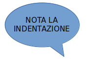

========================================================
**Sesto passo: le istruzioni condizionali if e if else**
========================================================

.. role:: red

.. role:: boltred

.. role:: boltblue

.. role:: blue

Supponiamo di voler mandare un messaggio gentile a 
chi usa il nostro programma. Nello scrivere 
il programma ci accorgiamo che il messaggio e' diverso a 
seconda che il nostro interlocutore sia una 
femmina oppure un maschio. Allora gli chiediamo se e' femmina 
o maschio e poi scriviamo un messaggio se e' una 
femmina, un messaggio diverso se e' un maschio. Come 
fare? Usiamo l’istruzione:

:boltred:`if`

L'istruzione che ci permette di scegliere cosa fare si chiama if, che in inglese 
significa SE. 

Questo e' il codice del programma che descrive l'esempio appena fatto :

.. activecode:: esempio

   nome = input ("Scrivi il tuo nome ")
   utente = input ("Sei femmina? ")
   if utente == "si":
       print("Cara ", nome, ", sei bravissima!")
   if utente == "no":
   	   print("Caro ", nome, ", sei bravissimo!")

(NOTA BENE: i rettangolini colorati evidenziano gli spazi 
che devi lasciare. Questo metodo di scrittura si chiama INDENTAZIONE).

Osserva nell’esempio precedente che occorre scrivere 
prima la parola if, poi la condizione poi i : (due punti), e 
infine l’elenco delle cose da fare, scritte un poco a destra 
nella riga successiva, secondo questo schema:

:boltred:`if e poi una condizione`

     :boltred:`azione 1`

     :boltred:`azione 2`

     :boltred:`……..`

Hai notato che nell’esempio precedente abbiamo usato 
un nuovo carattere? :red:`E' il segno di uguaglianza ==` 
(doppio uguale) che utilizziamo per indicare “:red:`uguale a`".
Questo perché in Python il simbolo di uguale ( = ) ha il 
significato: “metti nella scatola”. Serve ad assegnare un 
valore a una variabile, come ad esempio: Scatola1 = 7.

Oltre al segno di uguaglianza esistono i segni di :blue:`disuguaglianza`. Li utilizziamo 
quando  occorre indicare una condizione di confronto e precisamente:

+---------------+--------------------+-----------------+
|:blue:`simbolo`|:blue:`significato` | :blue:`esempio:`|
+===============+====================+=================+
|     ==        |     uguale a       |       5=5       |
+---------------+--------------------+-----------------+
|     >         |    maggiore di     |       6>3       |
+---------------+--------------------+-----------------+
|     <         |    minore di       |       3<7       |
+---------------+--------------------+-----------------+
|    >=         | maggiore o uguale a|      x>=y       |
+---------------+--------------------+-----------------+
|    <=         |   minore o uguale a|      y<=x       |
+---------------+--------------------+-----------------+
|   <>          |     diverso da     |       5<>1      |
+---------------+--------------------+-----------------+

Adesso che abbiamo imparato i nuovi segni, vediamo due esempi di 
programmi:

.. activecode:: esempio2

	voto = input ("che voto hai preso?")
	if voto >= 6 : 
		print ("promosso!")
   

.. activecode:: esempio3

	tuoi_soldi = input ("quanti soldi hai?")
	if tuoi_soldi < "3": 
		print ("Non puoi comprare la pizza!")

:boltred:`La frase che segue la if si chiama: condizione`

Quando la condizione e' soddisfatta, si esegue l'istruzione che segue i due 
punti (:), altrimenti non si fa nulla.	

Consideriamo l’esempio:
*Il voto e' maggiore o uguale a 6? 
Allora sei promosso!*

L'istruzione if viene scritta abitualmente nel modo seguente:

+-----------------------------+----------------------------+
|struttura                    |:blue:`esempio`             |
+-----------------------------+----------------------------+
|if <condizione>:             |:blue:`if voto >=6:`        |
+-----------------------------+----------------------------+
|   <istruzione>              | :blue:`|print("promosso")` |
+-----------------------------+----------------------------+

**L’istruzione deve stare più all’interno della prima riga** (hai presente i 
margini del foglio? Se la prima riga è allineata al margine sinistro, le linee 
successive devono stare più a destra). Si dice che devono essere “indentate”. 

Dopo la “condizione” anziché una sola istruzione, come negli esempi 
precedenti, possono essere scritte due o più istruzioni:

+--------------------------+-------------------------+
|struttura                 |:blue:`esempio`          |
+--------------------------+-------------------------+
| if<condizione>:          | if voto>=6:             |
+--------------------------+-------------------------+
|  <istruzione1>           |  print("promosso")      |
+--------------------------+-------------------------+
|  <istruzione2>           | print("mamma contenta") |
+--------------------------+-------------------------+

Non c'è un limite al numero di istruzioni che possono comparire nel corpo di 
un'istruzione if ma deve sempre essercene almeno una.	

**La prima riga di istruzioni che non sta più all'interno (che non e' più** 
**“indentata”) segnala al computer la fine del blocco di istruzioni e non**
**ne fa parte.** 

Prova a scrivere questo programma:

.. activecode:: esempio4
    
	if 5 > 10:
		print ("sun")
	print ("moon")

il computer scriverà “moon” perchè la linea non fa più parte dell’istruzione if. 
Ma se la linea print (“moon”) viene indentata farà parte dell’if e non verrà più 
stampata. La versione corretta del programma è:

::

	if 5 > 10:
		print ("sun")
		print ("moon")

Vediamo adesso un esempio in cui e' un po' più 
complicato prendere una decisione perché 
consideriamo più condizioni insieme:

Hai più di sette anni?
Sei bravo a giocare a calcio?
Se sì puoi iscriverti alla scuola calcio del Milan.

.. activecode:: esempio5

	ragazzo = input ("Hai piu' di sette anni? ")
	campione = input ("Sei bravo a giocare a calcio?")
	if ragazzo == "si":
        	if campione == "si":
        		print("Puoi iscriverti alla scuola calcio del Milan")
   

Per semplificare la scrittura del programma, possiamo usare tre nuovi operatori 
chiamati :boltblue:`or, and, not:`

+-------------------+---------------------+
|     operatore     |    significato      | 
+===================+=====================+
| or                | "oppure"            |
+-------------------+---------------------+
| and               | "e inoltre"         |
+-------------------+---------------------+
| not               | "non"               |
+-------------------+---------------------+

Usando gli operatori logici, l’ultimo programma che abbiamo scritto diventa 
molto semplice:

::

	if vecchietto == "si" and campione == "si":
		print ("Puoi iscriverti alla scuola calcio del Milan")

Vediamo alcuni esempi concreti in cui questi nuovi operatori sono necessari. 

Operatore Logico AND
:::::::::::::::::::::

SE  hai fatto i compiti E c'è il sole puoi andare in bicicletta.

::

	if compiti == "si" and sole == "si"
		print ("puoi andare in bicicletta")

SE i tre lati di un triangolo sono uguali,  il triangolo è equilatero

::

	if lato1 == lato2 and lato1 == lato3:
		print ("triangolo equilatero")

SE  un numero è maggiore di 10 E minore di 20 allora è compreso fra 10 e 20

::

	if num > 10 and num < 20:
		print ("il numero ", num, " è compreso fra 10 e 20")

*NOTA BENE! Tutte e due le condizioni richieste devono essere soddisfatte, sia quella* 
*dopo if sia quella dopo and. Il messaggio viene visualizzato solo in questo caso.*

Operatore Logico OR
::::::::::::::::::::

SE in un triangolo la lunghezza del lato1 e quella del lato2 sono uguali OPPURE 
sono uguali le lunghezze del lato1 e quella del lato3 allora il triangolo è 
isoscele.

::

	if lato1 == lato2 or lato1 == lato3 or lato2 ==lato3:
		print "triangolo isoscele"

NOTA BENE: con l’operatore **or** non è necessario che siano 
soddisfatte contemporaneamente tutte le condizioni in 
esame, ma è sufficiente che, fra tante condizioni, ne sia 
verificata solo una.

Operatore Logico NOT
:::::::::::::::::::::

SE NON hai compiti da fare puoi andare a giocare.

::

	if not fatto_compiti == "si":
		print ("Non puoi andare a giocare")

Spesso ci capita di voler fare una cosa se la 
condizione è vera e un’altra se la condizione è falsa. 
In questo caso dobbiamo utilizzare l’istruzione:

if…else.
::::::::

Vediamo alcuni semplici esempi:

.. activecode:: esempio6

   x = input ("digita un valore da assegnare a x")
   if x < "3":
	print ("x e' minore di 3")
   else:   
	print ("x non e' minore di 3")  

.. activecode:: esempio7

   ring = input ("Suonano alla porta? ")
   if ring == "si":
	 print ("vado ad aprire")
   else:
	 print ("continuo a leggere")	

Se voto e' >= 6 stampo “promosso”, se voto e' < 6 stampo “bocciato”

.. activecode:: esempio8

	voto = int(input("che voto hai preso? "))
	if voto >= 6 :
		print ("promosso!")
	else:
		print ("bocciato!")

.. activecode:: esempio8.1

	fatto_compiti = input ( "hai fatto i compiti  ") 
	if not fatto_compiti == "si" :
		print ( "Non puoi andare a giocare ")
	else:
		print ( "Bravo! Vai a giocare ")

.. activecode:: esempio8.2

	voto = int(input( "che voto hai preso?  "))
	if voto >= 6 :
		print ("promosso")
		print ("bravo!")
	else:
		print ("bocciato")
		print ("devi studiare di piu'!")

.. activecode:: esempio8.3

	nome = input ("Come ti chiami? ")
	femmina = input ("Sei femmina? ")
	if femmina == "si":
		print ("Cara ", nome,)
		print (", sei bravissima!")
	else:
		print ("Caro ", nome)
		print (", sei bravissimo!")

Area del rettangolo:

.. activecode:: esempio9

	risposta = input("Vuoi sapere come calcolare l'area del rettangolo? (S/N) ")
	if risposta == "S":
		print ("devi moltiplicare la base per l'altezza")
	else:
		print ("lo so gia'!")

Scrittori:

.. activecode:: esempio10
   
   risposta1 = input ("chi e' l'autore dei Promessi Sposi? ")
   if risposta1 == "Manzoni":
	  print ("la risposta e' esatta")
	  print ("bravo!!")
   else:
	  print ("risposta errata!")
	  print ("la risposta esatta e': Manzoni")
	  print ("Studia di piu'")
   risposta2 = input ("chi e' l'autore della Divina Commedia? ")
   if risposta2 == "Dante":
	  print ("la risposta e' esatta")
	  print ("bravo!!")
   else:
	  print ("risposta errata!")
	  print ("la risposta esatta e': Dante")
	  print ("Ripassa la lezione.")

Purtroppo molte volte ci sono più di due 
possibilità di scelta e quindi abbiamo bisogno di 
un’altra soluzione. Usiamo l’operatore:

elif
:::::

elif  è l'abbreviazione di "else if", che in inglese significa 
"altrimenti se".  
In modo formale questa istruzione viene definita: condizioni in serie.
**Non c'è alcun limite al numero di istruzioni elif.**

Vediamo subito qualche esempio:

.. activecode:: esempio11

	x = int(input("indica il numero x "))
	y = int(input("indica il numero y "))
	if x < y: 
		print(x,"e'minore di",y)
	elif x > y:
		print(x,"e'maggiore di",y)
	else:
		print(x,"e",y,"sono uguali")

.. activecode:: esempio12

	nome = input("qual e' il tuo nome? ")
	if nome == "Carlo":
		print ("il tuo onomastico e' il 4 novembre")
	elif nome == "Francesca":
		print ("il tuo onomastico e' il 9 marzo")
	elif nome == "Anna":
		print ("il tuo onomastico e' il 26 luglio")
	elif nome == "Andrea":
		print ("il tuo onomastico e' il 30 novembre")
	elif nome == "Stefano":
		print ("il tuo onomastico e' il 26 dicembre")
	else:
		print ("non so quando e' il tuo onomastico ma ti auguro che ogni giorno sia la tua festa!! ")

.. activecode:: esempio13

	numero = 78
	indovina = 0
	print ("indovina il numero")
	indovina = int (input ("inserisci il numero:"))
	if indovina > numero:	
		 print ("troppo alto")
	elif indovina < numero:	
         print ("troppo basso")
	else:
		 print ("GIUSTO!")

Qualche volta non è necessario l’else finale, come in questo esempio:

.. activecode:: esempio14

	print ("Stampa se un numero e' pari o dispari")
	numero = int (input ("scrivi un numero: "))
	if numero % 2 == 0:
		print (numero, "e' pari")
	elif numero % 2 == 1:
		print (numero, " e' dispari")

:boltblue:`Esercitiamoci un po’`

------------

Esercizio n. 1

Che cosa significano le due parole if e else?

------------

Esercizio n. 2

Quale parola introduce un lavoro che deve essere svolto come 

conseguenza di una condizione?

------------

Esercizio n. 3

Che cosa fa il computer quando non e' soddisfatta la condizione introdotta da 

if?

------------

Esercizio n. 4

Scrivi un esempio di scelta condizionata in cui compaia l’operatore and, una in 

cui compaia or e uno in cui compaia not.

------------

Esercizio n. 5

Scrivi il programma relativo alla seguente scelta condizionata:

SE squilla il telefono ALLORA vai a rispondere.

------------

Esercizio n. 6

Spiega il significato delle seguenti istruzioni.

::

	a)if numero <> 20:
		print (numero)

::

	b)if qui <20: 
		quo = 30

------------

Esercizio n. 7

Scrivi il programma per controllare se un numero e' 

positivo.

------------

Esercizio n. 8

Scrivi il programma che controlla il risultato di una addizione, dati due numeri.

------------

Esercizio n. 9

Scrivi il programma che distingue i numeri positivi e i numeri negativi.

------------

Esercizio n. 10

Scrivi un programma che dati due numeri, li visualizza in ordine crescente 

(o decrescente).

------------

Esercizio n. 11

Scrivi un programma che dia consigli per i vestiti se piove, se nevica e se fa 

freddo.

------------

Esercizio n. 12

Scrivi il programma che chiede di indicare l'autore di un libro, se e' sbagliato 

stampa “risposta errata”, se e' corretto stampa “risposta esatta” e prosegue a 

chiedere un altro autore per un altro libro (puoi ripeterlo quante volte vuoi)

Per esercitarti un po' di piu' puoi scrivere lo stesso programma per i seguenti 

argomenti:

a) calciatori e squadre di calcio

b) nazioni e capitali

c) città e nome degli abitanti.

.. activecode:: esercizio
   :nocanvas:
   :language: python

