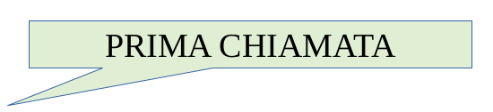
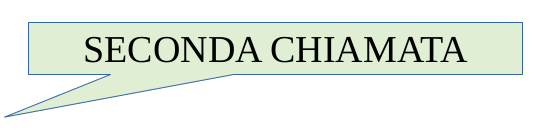
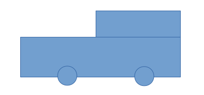

==========================
Settimo passo: le Funzioni
==========================

.. role:: boltred

.. role:: red

.. role:: boltblue

.. role:: blue

Impariamo insieme:

- cos’è una funzione
- quando è utile usare una funzione
- come si scrive una funzione
- come si fa a chiamare una funzione

::

	risposta1 = input ("Chi e' l'autore dei Promessi Sposi? ")
	if risposta1 == "Manzoni":
		print ("La risposta e' esatta")
		print ("Bravo!!")
	else:
		print ("Risposta errata!")
		print ("La risposta esatta e': Manzoni")
		print ("Studia di piu'")
	risposta2 = input ("Chi e' l'autore della Divina Commedia? ")
	if risposta2 == "Dante":
		print ("La risposta e' esatta")
		print ("Bravo!!")
	else:
		print ("Risposta errata!")
		print ("La risposta esatta e': Dante")
		print ("Ripassa la lezione")

Hai osservato come il programmatore nel trattare la seconda risposta ripete molte cose che aveva già scritto per la prima ? Questo non è né comodo né veloce.
Fortunatamente esiste in Python, come in molti altri linguaggi di programmazione, un meccanismo semplice per specificare una sola volta le operazioni ricorrenti e per richiamare quelle operazioni ogni volta che ci servono.

Questo meccanismo è la :boltred:`“funzione”`.

Una funzione è, in sostanza, un pezzo di programma cui viene dato un nome, una
sequenza di istruzioni che esegue una determinata sequenza di operazioni, che può essere utilizzata tante volte nel corso di un programma.

Le funzioni sono utili quando dobbiamo far eseguire al computer più volte le stesse operazioni perché queste si possono scrivere una sola volta nella funzione, che sarà identificata con un nome, e ogni volta che abbiamo bisogno di eseguire quelle operazioni chiamiamo la funzione, scrivendo semplicemente il suo nome.

Possiamo immaginare la funzione come un “cameriere” (in gergo tecnico tra gli informatici si chiama “servente”) al quale si insegnano certe mansioni da svolgere in casa.

Ad esempio, al cameriere si spiega come “preparare la
colazione” nel modo seguente:

- preparare i croissant
- fare il caffè
- scaldare il latte

Dopo averlo spiegato una volta non è più necessario ripetere tutte le volte gli ordini 1, 2 e 3 ma basta chiedere al cameriere di “preparare la colazione”.

Nel caso del nostro esempio del programma degli “scrittori” si deve chiedere al cameriere, ossia alla funzione, di eseguire le seguenti operazioni:

- porre la domanda e acquisire la risposta
- verificare se la risposta data è uguale a quella corretta
- se la risposta è corretta, visualizzare il messaggio di congratulazioni
- se la risposta è errata, visualizzare il messaggio di rimprovero e il messaggio per ricordare la risposta corretta.

Il nostro “servente”, ossia la funzione, dovrà eseguire proprio queste operazioni, ogni volta che porremo una nuova domanda. Al cameriere, ossia alla funzione, sarà sufficiente indicare la domanda e la risposta esatta.

In pratica dobbiamo scrivere un breve programma che esegua le operazioni che abbiamo elencato, dopo aver dato il nome alla funzione e alle scatole (ossia alle variabili) di cui la funzione avrà bisogno. Nel nostro caso, :red:`INTERROGAZIONE` sarà il nome della funzione.
:boltred:`DOMANDA` sarà il nome della scatola contenente la domanda.
:boltred:`RISPOSTA_ESATTA` sarà la scatola destinata a contenere la risposta esatta.

**Tutto questo andrà scritto su una sola riga, che sarà la prima linea della funzione.**

-----------------------
Definizione di funzione
-----------------------

:boltred:`def INTERROGAZIONE (domanda, risposta_esatta):`

Questa linea indica all'interprete che vogliamo definire un blocco di istruzioni che potrà essere eseguito a richiesta in un qualunque altro punto del programma semplicemente scrivendo il suo nome (interrogazione), dopo aver indicato la domanda e la risposta corretta.

Quindi la prima linea della funzione dovrà contenere:

+-----------------------------------------------------------+--------------------------+
|la parolina def			      		    |:boltred:`DEF`	       |
|(abbreviazione di define, definisci)	    		    |			       |
+-----------------------------------------------------------+--------------------------+
|il nome che ho deciso di dare alla funzione    	    |:boltred:`INTERROGAZIONE` |
+-----------------------------------------------------------+--------------------------+
|i nomi delle scatole su cui lavorerà la funzione, separati |:boltred:`DOMANDA`	       |
|da virgole e racchiusi da parentesi			    |:boltred:`RISPOSTA_ESATTA`|
+-----------------------------------------------------------+--------------------------+

Ricordati di mettere sempre i due punti dopo le parentesi e di indentare nel modo corretto, come puoi vedere negli esempi seguenti. La prima linea del programma non più indentata segnala a Python la fine della funzione.

Dopo la definizione, occorre scrivere la funzione, cioè il programma che lavorerà sulle scatole indicate. Nel nostro caso:

::

	def interrogazione(domanda, risposta_esatta):
	risposta_allievo = input (domanda)
	if risposta_esatta == risposta_allievo:
		print ("La risposta e' esatta")
		print ("Bravissimo")
	else:
		print ("Risposta errata")
		print ("La risposta esatta e' ", risposta_esatta)
		print ("studia di piu'!")

Confrontiamolo ora con il pezzo di programma da cui siamo partiti e che non volevamo ripetere tante volte.

Notiamo subito che il codice è diventato molto più generale perchè tutte le risposte sono scritte dentro le variabili che potranno assumere valori diversi in situazioni diverse.
Mentre il programma valeva solo per domande sugli scrittori, la funzione può essere usata in un programma che pone domande di storia, di geografia, di calcio ecc.
La seguente tabella mostra come è nata la funzione a partire dal programma base.

**Programma**
::

	if risposta == "Manzoni":
		print ("la risposta è esatta")
		print ("bravo!!")
	else:
		print ("risposta errata!")
		print ("la risposta esatta è: Manzoni")
		print ("Studia di più")

----

**Funzione**
::

	def interrogazione (domanda,risposta_esatta):
		risposta_allievo = input (domanda)
		if risposta_esatta == risposta_allievo:
			print ("La risposta è esatta")
			print ("Bravissimo")
		else:
			print ("Risposta errata")
			print (" La risposta esatta è ",risposta_esatta)
			print ("studia di più!")

Nota bene: puoi usare qualsiasi nome per una funzione, tranne l e parole riservate di Python. Le definizioni di funzione sono delle istruzioni come le altre.Tuttavia saranno eseguite soltanto quando saranno chiamate.

|
| :boltblue:`CHIAMATA DI FUNZIONE`
|

Le istruzioni all’interno di una definizione di funzione non sono eseguite finché la funzione non viene chiamata.

Ora dobbiamo imparare a chiamare la funzione, ossia ordinare alla funzione stessa di eseguire le operazioni in essa contenute.

**In generale, la chiamata di una funzione viene effettuata scrivendo il nome della funzione, seguita dai nomi delle scatole su cui lavorare separati da virgole e racchiuse da parentesi. Nel caso del programma che avevamo scritto avremo:**

| **domanda1 = "chi e' l'autore dei Promessi Sposi? "**
| **risposta_esatta1 = "Manzoni"**
| **interrogazione (domanda1, risposta_esatta1)**

| **domanda2 = "chi e' l'autore della Divina Commedia? "**
| **risposta_esatta2 = "Dante"**
| **interrogazione (domanda2, risposta_esatta2)**

Fermiamoci a riflettere e a riassumere ciò che abbiamo detto finora a proposito di programmi e del flusso di esecuzione deiprogrammi.

**L'esecuzione di una funzione inizia sempre alla prima riga del programma** e le istruzioni sono eseguite una alla volta dall'alto verso il basso.
**Una funzione deve essere definita prima del suo uso** perché
Python deve sapere che la funzione esiste e cosa fa.
**La definizione di funzione non altera il flusso di esecuzione del programma e le istruzioni all'interno della funzione non sono eseguite finché questa non viene chiamata** (questo vuol dire che, se definisco la funzione all'inizio del programma, Python legge la definizione ma non fa nulla e prosegue nell'esecuzione del programma finché non trova la chiamata della funzione).
**La chiamata della funzione è una deviazione nel flusso di esecuzione:** invece di proseguire con l'istruzione successiva, l'esecuzione salta alla prima riga della funzione chiamata ed esegue tutte le sue istruzioni; alla fine della funzione il flusso riprende dal punto dov'era stato deviato dalla chiamata di funzione. Fortunatamente Python è sufficientemente intelligente da ricordare dove il flusso di esecuzione viene via via interrotto e sa dove riprendere quando una funzione è conclusa
**Quando il flusso del programma giunge all'ultima istruzione, dopo la sua esecuzione il programma è terminato.** Ricorda che la definizione della funzione termina con l’ultima istruzione indentata.
Vediamo ora il nostro programma scritto con e senza l'uso della funzione
“interrogazione”:

**senza**
::

	risposta1 = input ("chi e' l'autore dei Promessi Sposi? ")
	if risposta1 == "Manzoni":
		print ("la risposta e' esatta")
		print ("bravo!!")
	else:
		print ("risposta errata!")
		print ("la risposta esatta e': Manzoni")
		print ("Studia di piu'")
	risposta2 = input ("chi e' l'autore della Divina Commedia? ")
	if risposta2 == "Dante":
		print ("la risposta e' esatta")
		print ("bravo!!")
	else:
		print ("risposta errata!")
		print ("la risposta esatta e': Dante")
		print ("Studia di piu'")

----

**con**
::

	def interrogazione (domanda,risposta_esatta):
		risposta_allievo = input (domanda)
		if risposta_esatta == risposta_allievo:
			print ("La risposta e' esatta")
			print ("Bravissimo")
		else:
			print ("Risposta errata")
			print ("La risposta esatta e' ", risposta_esatta)
			print ("Studia di piu'!")
	domanda1 = "chi e' l'autore dei Promessi Sposi? "
	risposta_esatta1 = "Manzoni"
	interrogazione (domanda1, risposta_esatta1)
	domanda2 = "chi e' l'autore della Divina Commedia? "
	risposta_esatta2 = "Dante"
	interrogazione (domanda2, risposta_esatta2)

Nota bene: i nomi delle scatole usati nell'istruzione di chiamata della funzione sono diversi dai nomi delle scatole usati nella definizione.

**DEFINIZIONE**
::

	def interrogazione (domanda, risposta_esatta):

----

**CHIAMATA**
::

	interrogazione (domanda1, risposta_esatta1)

La prima cosa che fa la funzione quando viene chiamata è prendere le scatole usate nella istruzione con cui è stata chiamata, scoperchiarle e mettere il loro contenuto nelle corrispondenti scatole usate all'interno della funzione.

**Il contenuto di domanda1 viene scritto in domanda e il contenuto di risposta_esatta1 viene scritto in risposta_esatta.**

Perché è necessaria questa operazione?
Le scatole all'interno della funzione sono “invisibili” all'esterno e sono utilizzate solo dentro il corpo della funzione.
In questo modo la semplice funzione che abbiamo scritto potrà essere utilizzata da voi per altri programmi o da qualche vostro amico per costruire programmi più complicati. E questo è il secondo motivo, forse il più importante, per cui si scrivono le funzioni.

I programmi attuali sono diventati cosi complicati che nessun programmatore, per quanto bravo, riuscirebbe a scriverli da solo. Qualunque programma è sempre composto per una piccola parte da nuove istruzioni e per la maggior parte da funzioni già scritte in precedenza.

Ora che sai cosa sono le funzioni, devi sapere anche che Python è provvisto di numerose e importanti “librerie” di funzioni già scritte, che ricoprono le esigenze dei ricercatori di tutte le aree della scienza.

Ad esempio, una libreria chiamata “**math**” consente di fare calcoli matematici anche molto complicati.
Prima di poter usare le funzioni fornite da math, devi dire a Python di caricare quelle funzioni che ti servono in memoria.
Questa operazione, che si chiama "importazione", può essere ottenuta scrivendo:
::

	import math

|
| :boltred:`TI PROPONGO UN ESERCIZIO BASATO SULL’UTILIZZO DELLE FUNZIONI:`
| 	**inserisci un numero e stampa la sua radice quadrata**

.. activecode:: code1
   :coach:

   import math
   numero = float(input("Scrivi un numero "))
   print ("La radice quadrata di", numero,'e`', math.sqrt(numero))

--------------------------------------------------------------
Ancora funzioni...ma un po’ più difficili: l’istruzione return
--------------------------------------------------------------

In tutti gli esempi precedenti, la funzione chiamata eseguiva completamente una certa attività. A differenza dei casi precedenti, qualche volta la funzione chiamata esegue dei calcoli il cui risultato serve al programma chiamante.
Vediamo un esempio:
::

	def doppio(numero):
		numero_per_due = numero * 2
		return numero_per_due

L’istruzione :blue:`return numero_per_due` ordina alla funzione doppio di trasmettere al programma chiamante il valore di :blue:`numero_per_due`.

Nel programma chiamante non si dovrà scrivere numero_per_due perché questa è una varbile della funzione e le variabili delle funzioni sono invisibili all’esterno, ma si
scriverà un’istruzione del tipo: pippo = 7 + doppio(5)

:boltblue:`definizione di funzione`
::

	def doppio(numero):
		numero_per_due = numero * 2
		return numero_per_due

----

:boltblue:`programma principale`
::

	numero = float(input("Inserisci un numero "))
	pippo = 7 + doppio(numero)
	print ("Se al numero 7 aggiungo il doppio di ", numero)
	print ("Il risultato sarà: ", pippo)

In sostanza tutto avviene come se il contenuto della scatola della funzione
:blue:`numero_per_due` fosse trasferito nella scatola del programma principale :blue:`doppio`.

|
| :boltblue:`Funzioni che chiamano funzioni`
|

Nel corpo di una funzione si può anche scrivere una o più istruzioni che chiamino altre funzioni. Al limite, una funzione può anche chiamare se stessa.
Supponiamo di voler calcolare il fattoriale (prodotto dei successivi numeri interi da 1 fino a un numero dato) del numero 7, ossia
::

	fatt = 7*6*5*4*3*2

La funzione che calcola il fattoriale di un numero n dovrà essere scritta come n moltiplicato per il fattoriale di **(n-1)**;

ad esempio, se a n attribuiamo il valore **7**:
::

	fatt(7) = 7 * fatt(6)

**La funzione sarà**
::

	def fatt(n):
		if n == 1:
			return 1
		else:
			return n * fatt(n-1)

----

**Il programma sarà**

::

	def fatt(n):
		if n == 1:
			return 1
		else:
			return n * fatt(n - 1)
	n = int(input ("Scrivi un numero "))
	print ("Il fattoriale di ", n, " è ", fatt(n))

----

**In questo esempio calcoliamo l'area della figura.**

Scriviamo una funzione che consenta di calcolare l’area di un rettangolo:
::

	def area_rettangolo (base, altezza):
		return base * altezza

Scriviamo una funzione che calcoli l’area di un cerchio di raggio r:

::

	def area_cerchio (raggio):
		return 3.14 * raggio**2

Utilizziamo ora le due funzioni che abbiamo scritto per calcolare l’area della figura azzurra:

#programma che calcola l'area della figura azzurra
::

	def area_rettangolo (base, altezza):
		return base * altezza
	def area_cerchio (raggio):
		return 3.14 * raggio**2
	area_figura = area_rettangolo (3,2) + area_rettangolo(5,3) + 2 * area_cerchio(1)/2
	print ("L'area della figura azzurra è ", area_figura)

**Quest’ultimo esempio mostra come calcolare la potenza di un numero elevato a un numero intero, usando una funzione definita da noi.**
::

	def potenza(numero, esponente):
		if esponente == 1:
			return numero
		else:
			return potenza(numero, esponente-1) * numero
	numero = float(input("Inserisci un numero "))
	esponente = int(input("Inserisci l'esponente "))
	print (potenza(numero, esponente))

|
| :boltred:`ESERCIZI`
|

1. Scrivi un programma utilizzando la funzione che chiede due numeri e poi li sommi tra loro.

.. activecode:: es1

----

2. Scrivi un programma utilizzando la funzione che concateni due stringhe (per esempio due nomi Sandro e Silvia).

.. activecode:: es2

----

3. Scrivi un programma utilizzando la funzione che visualizzi i colori dell’arcobaleno.

.. activecode:: es3

----

4.

.. clickablearea:: click1
    :question: Trova l'errore.
    :iscode:
    :feedback: Ripassa la chiamata di funzione.

    :click-incorrect:def facciamofesta(musica)::endclick:
        :click-incorrect:torte = 5:endclick:
        :click-incorrect:print ("Stasera ci sono",torte,"torte, e la musica di", musica):endclick:
            :click-incorrect:print ("Stasera ci sono",torte,"torte, e la musica di", musica):endclick:
            :click-correct:facciamofesta():endclick:

----

5. Scrivi un programma utilizzando la funzione che chiede qual è il tuo primo piatto preferito e il programma risponde “A me piacciono i peperoni in carpione” e poi chiede qual è il secondo preferito e risponde sempre “A me piacciono i peperoni in carpione”.

.. activecode:: es5

----

6. Scrivi un programma utilizzando la funzione e poi un altro programma senza utilizzare le funzioni che chiede un numero, ne fa la somma con 22, lo moltiplica per 5 e poi lo divide per 8 e poi fa la stesse operazioni per un secondo numero.

.. activecode:: es6

----

7. Scrivi un programma utilizzando la funzione che chiede 2 numeri e visualizzi la somma, il valore medio e visualizzi il minimo tra i due.

.. activecode:: es7

----

8. Scrivi un programma utilizzando la funzione che calcoli l’area e il volume di un parallelepipedo rettangolo.

.. activecode:: es8

----

:boltred:`Per smaltire la fatica degli esercizi, facciamo una pausa.`

Ho chiesto ad Angelo di spiegarti bene che cos’è il software libero e cosa significa esattamente “open source”

Ecco il suo racconto.

Diciamo subito che software “libero” e software “opensource” non sono sinonimi, anche se sono strettamente
legati tra loro.

Prima di spiegarti cosa sono ritengo doveroso citare due
importanti personaggi del mondo informatico: **Richard Stallman** e **Linus Torvalds**.
Stallman, statunitense, (New York, 16 marzo 1953) è un programmatore e hacker statunitense. Nel settembre del 1983 lanciò il progetto GNU per creare un sistema operativo libero. Con il lancio del Progetto GNU, il movimento del software libero prese vita; nell'Ottobre del 1985 venne fondata la Free Software Foundation (FSF).

Secondo Richard Stallman un software per poter essere definito libero deve garantire quattro **"libertà fondamentali"**:

0. **Libertà di eseguire il programma per qualsiasi scopo (chiamata "libertà 0")**

1. **Libertà di studiare il programma e modificarlo ("libertà 1")**

2. **Libertà di copiare il programma in modo da aiutare il prossimo ("libertà 2")**

3. **Libertà di migliorare il programma e di distribuirne pubblicamente i miglioramenti, in modo tale che tutta la comunità ne tragga beneficio ("libertà 3")**

Torvalds è colui che ha iniziato lo sviluppo del **kernel Linux**.

Il sistema operativo GNU/Linux, ottenuto unendo Linux con il sistema GNU, è entrato nella storia come valida alternativa ai sistemi operativi commerciali a licenza chiusa (come per esempio Microsoft Windows).

In informatica, open source (termine inglese che significa sorgente aperto) indica un software rilasciato con un tipo di licenza per la quale il codice sorgente è lasciato alla disponibilità di eventuali sviluppatori, in modo che con la collaborazione (in genere libera e spontanea) il prodotto finale possa raggiungere una complessità maggiore di quanto potrebbe ottenere un singolo gruppo di programmazione.

(da: http://it.wikipedia.org/wiki/linux; https://it.wikipedia.org/wiki/GNU)
