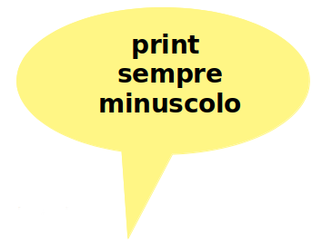

=========================
Terzo passo: Le Variabili
=========================

.. role:: boltred

.. role:: blue
                             
Il modo più semplice per farsi consegnare una scatola dal calcolatore, darle un nome e riempirla con un numero                       
e’ quello di scrivere una frase come la seguente, che è chiamata :boltred:`“ISTRUZIONE DI ASSEGNAZIONE”`: 

:boltred:`SCATOLA1=7`
Se la scatola di nome SCATOLA1 non è mai stata usata, Python crea una scatola nuova, la chiama SCATOLA1 e pone il numero 7 in quella scatola. 
Se  invece la scatola di nome SCATOLA1 è già stata usata, Python toglie il suo vecchio contenuto e mette il numero 7 come suo nuovo contenuto.

La scatola rappresenta quella che i matematici chiamano **variabile**.
Questo nome ci ricorda che il contenuto di una scatola può cambiare da un momento all’altro.
Ad essa e’ possibile assegnare un valore con l’istruzione di assegnazione.
Il contenuto di una scatola può essere un numero, oppure un carattere o un messaggio (ossia una sequenza di caratteri).
L’istruzione di assegnazione contiene un ordine per il calcolatore e costituisce un nuovo esempio di “istruzione”, ovvero un’operazione che Python capisce ed e’ in grado di eseguire.
L’istruzione di assegnazione e’ costituita dal nome della scatola seguito dal segno =. 

   SCATOLA1 = 7
 
   SCATOLA2 = 3.14

In una scatola posso mettere numeri oppure messaggi compresi tra “….”

SCATOLA3 = "come va?"

Osserva ancora: il simbolo :boltred:`=` non ha il significato matematico che conosci.

Infatti, nell'istruzione di assegnazione :   
SCATOLA1 = 7

il simbolo :boltred:`=` significa:     
**nella scatola di nome SCATOLA1 metti il numero 7**.   

-----------

**DOMANDA**

*Come fa il calcolatore a riempire una scatola con un numero e a farci vedere il suo contenuto?*
*RISPOSTA*  

**Con l’ istruzione di stampa** :boltred:`print` **possiamo ordinare al calcolatore** **di comunicare** **il contenuto di una** 
**scatola**.                                                                                                                                                                                 

Se scriviamo **print(SCATOLA1)** il calcolatore:

• cerca la scatola indicata (in questo caso SCATOLA1)

• la apre e ne legge il contenuto

• presenta sullo schermo il contenuto (in questo caso 7)

Facciamo un esempio:

.. activecode:: Print
   :coach:
   :caption: Usare print
    
   scatola1 = 8+4
   print (scatola1)

Dopo l’ordine di esecuzione, sul video comparirà il risultato dell'addizione: 12

Il nome dell’istruzione “print” deve essere sempre scritto 
minuscolo.
Le parentesi che delimitano il nome della scatola sono obbligatorie.

:blue:`Qualche esercizio per memorizzare:`
     
- scrivi in Python questa istruzione per il calcolatore:
  dammi la scatola GAIA3 e mettici dentro il numero 10

- Visualizza sul calcolatore il risultato di:
  SCATOLA2 = 10-3
  print (SCATOLA2)

- SCATOLA3 = 7*4
  print (SCATOLA3)

- SCATOLA4 = 20/2*5
  print(SCATOLA4)

------------------------------------

**FACCIAMO UNA BREVE INTERRUZIONE.**
 
VOGLIAMO RACCONTARTI LA STORIA DI PYTHON.

Il suo inventore è un geniale signore olandese: :boltred:`Guido Van Rossum`.

Nel Natale del 1989 Guido decise di passare le vacanze scrivendo un linguaggio di programmazione per il calcolatore che correggesse i difetti che, secondo lui, erano presenti in altri linguaggi. E così fece, creando uno tra i linguaggi di programmazione più moderni e diffusi nel mondo.
Dopo di lui moltissimi altri sviluppatori hanno proseguito ed ampliato il suo lavoro. 

A Guido piaceva tantissimo un gruppo di comici inglesi famosi negli anni sessanta del secolo ‘900: i Monty Python. A loro e alla loro comicità un po’ demenziale ha dedicato il suo lavoro. Niente a che vedere, quindi, con il nostro simpatico pitone verde.

Evidentemente i Monty Python dovevano piacere anche a molti altri nell’ambiente, perché non è l’unica volta che questi comici hanno dato il nome a qualcosa di informatico. 
Ad esempio, il termine “spam”, che viene utilizzato per indicare la posta elettronica indesiderata, deriva da un loro sketch, in cui compariva un ristorante nel cui menù erano inseriti tutti piatti ricoperti di spam, un tipo di carne macinata in scatola, particolarmente disgustosa.

Guido, dopo tanta fatica, ha deciso di donare a tutti il suo lavoro, così oggi noi possiamo disporre liberamente e gratuitamente di questo linguaggio. Un regalo di Natale molto speciale.

Nel mondo dell’informatica queste cose succedono...ne riparleremo.

Per adesso grazie a Guido e a tutti coloro che hanno continuato, e continuano, la sua opera.
Per noi, un motivo in più per impegnarci a fondo ad imparare la programmazione.

:boltred:`ESERCIZI CON VALUTAZIONE`

In base a quanto hai imparato sin qui, crea semplici programmi secondo le istruzioni che seguono:

- Il mago Silvan fa tanti giochi di magia: dal suo cappello a cilindro escono tre conigli bianchi e due neri. Quanti conigli sono nascosti nel cappello?

- Al mago Berri invece piace fare le magie con le maxi-carte: sono così grandi che quasi non stanno sul tavolo!Se ciascuna carta è lunga cm. 45 e larga cm. 30, quanto è grande la superficie di ciascuna carta?

- Quale superficie del tavolo occupano le carte con i quattro Assi usati dal mago Berri per i suoi giochi di magia, affiancati per il lato più lungo?

- Il mago Gian ha un bellissimo mantello di seta nera ricamato con tante stelle argentate. Per farlo il sarto ha utilizzato ben 5 metri di stoffa. Se la stoffa costava  13 € al metro, quanto ha speso per comprarla?

- Se un mantello costa 80 €, un cappello a cilindro 45 €, una bacchetta magica 20 €, un mazzo di maxi-carte 13 €, quanto costa l’attrezzatura per fare il mago? Se tutti i 37 alunni della scuola di magia sono vestiti come il mago, quanto è costata la loro attrezzatura?

- (**difficilissimo, se riesci a farlo sei un mago!**) Nella classe 3D della scuola ci sono 8 maschi e 10 femmine. Se Mario è alto m. 1.55, Fabio,  Matteo e Luca sono alti m. 1.60, Andrea, Aldo, Giovanni e Giacomo m. 1.50, qual è l’altezza media dei maschi della classe? Se Marta, Giovanna, Elisabetta e Francesca sono alte come Mario, mentre Stefania, Chiara e Simonetta sono alte m. 1.50, Daria e Domitilla sono 5 cm più piccole di Arianna che è alta m. 1,68, qual è l’altezza media delle femmine della classe?

.. activecode:: esercizi_es2
   :nocanvas:
   :language: python

